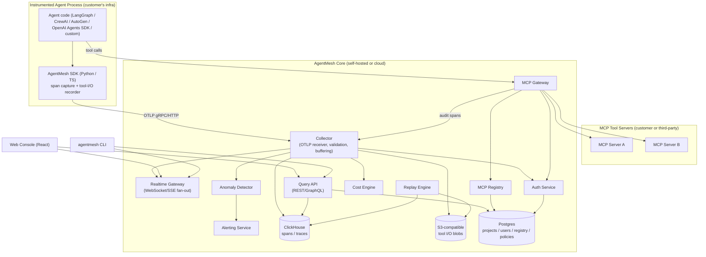

# AgentMesh — Architecture

## 1. System Diagram

## 2. Core Modules and Service Boundaries

| Module | Responsibility | Owns data | Language |
|---|---|---|---|
| **SDK (Python / TypeScript)** | Instrument agent code: wrap LLM calls and tool calls, capture inputs/outputs/timing/tokens, batch and export OTLP spans. Runs inside the customer's process — never sees the Trace Store directly. | none (stateless exporter) | Python, TypeScript |
| **Collector** | Receive OTLP spans, validate schema, deduplicate, write to ClickHouse, stream to Realtime Gateway, forward to Cost Engine and Anomaly Detector. | none (pure pipeline) | Go |
| **Trace Store** | Durable, queryable storage of spans/traces (ClickHouse) and large tool-I/O payloads (S3-compatible blob store). | traces, spans, blobs | ClickHouse + object storage |
| **Control-Plane Store** | Projects, users, API keys, MCP server registry entries, guardrail policies, alert rules. | relational metadata | Postgres |
| **Query API** | REST/GraphQL surface for the Web Console and CLI: list/search traces, fetch a trace DAG, fetch cost aggregates, manage registry/policies. | none (reads Trace Store + Control-Plane Store) | Go |
| **Realtime Gateway** | Push live span updates to connected Web Console/CLI sessions as a trace is still in flight. | none (pub/sub via Redis) | Go |
| **Replay Engine** | Reconstruct a trace's execution: replay recorded tool I/O against the (possibly modified) agent code, or replay stored LLM responses for a pure trajectory review. | reads Trace Store; writes replay-run records | Go/Python (see `System Design.md`) |
| **Anomaly Detector** | Streaming analysis of incoming spans: loop detection, cost-spike detection, guardrail-violation detection. | reads span stream; writes alerts | Go |
| **Cost Engine** | Attribute token/dollar cost to spans, aggregate by trace/agent/project/user. | reads span stream; writes cost aggregates | Go |
| **MCP Gateway** | Reverse proxy in front of MCP servers: OAuth 2.1 auth, per-caller rate limiting, guardrail policy enforcement, audit-log emission as spans. | none (stateless proxy; policies read from Postgres) | Go |
| **MCP Registry** | Catalog of registered MCP servers: metadata, version pinning, ownership, discovery. | registry entries (Postgres) | Go (part of Query API surface) |
| **Auth Service** | Issue/validate API keys and (post-MVP) OIDC-based user sessions; RBAC checks. | credentials, roles (Postgres) | Go |
| **Alerting Service** | Deliver anomaly/cost alerts to Slack/PagerDuty/webhooks. | none (reads alert events) | Go |
| **Web Console** | React SPA: trace list/search, trace DAG viewer, cost dashboards, replay UI, MCP registry management, alert configuration. | none (client) | TypeScript/React |
| **CLI (`agentmesh`)** | Local developer tool: tail live traces in a terminal UI, trigger a local replay, validate an MCP server manifest before registering it. | none (client) | Go |

Every module above is an independently deployable service (or, for MVP simplicity, a set of processes started together by Docker Compose — see `Repository Structure.md` and `Technical Roadmap.md` for the monorepo-vs-services tradeoff). Service boundaries are drawn along **data ownership**, not team ownership, since this is a single-developer-then-small-team project: each box above can be extracted into its own deployable unit without touching another box's internals, because they only communicate over gRPC/HTTP/pub-sub, never via shared in-process state.

## 3. Agent Architecture (what AgentMesh instruments, not what it runs)

AgentMesh does not execute agents; it observes them. The SDK defines a minimal, framework-agnostic **span model**:

- **Trace** — one top-level agent invocation (e.g., one user request to a support bot).
- **Span** — one unit of work inside a trace. Four span kinds:
  - `llm.call` — a single LLM request/response (model, prompt, completion, token usage).
  - `tool.call` — a single tool/function invocation (name, input, output, duration).
  - `agent.handoff` — control passed from one agent/sub-agent to another (source, target, shared context reference).
  - `mcp.call` — a tool call routed through the MCP Gateway (captured automatically by the Gateway even if the calling agent has no SDK integration).
- **Session** — an optional grouping of multiple traces that share user-level continuity (e.g., a multi-turn chat).

Framework-specific **reference integrations** (Milestone 3) translate each framework's native concepts onto this model:

| Framework | Maps to `llm.call` | Maps to `tool.call` | Maps to `agent.handoff` |
|---|---|---|---|
| LangGraph | node LLM invocation | node tool invocation | edge transition between graph nodes representing different agents |
| CrewAI | agent's LLM call | task tool execution | task delegation between crew members |
| AutoGen | agent message generation | function/tool call within a message | message routed to a different agent in the group chat |
| OpenAI Agents SDK | `Runner` LLM step | `FunctionTool` invocation | `handoff` primitive (native 1:1 mapping) |
| Custom loop | wherever the developer wraps the LLM client call | wherever the developer wraps the tool dispatcher | wherever the developer wraps a sub-agent invocation |

## 4. Plugin Architecture

Two independent plugin surfaces:

1. **SDK instrumentation adapters** — thin, community-contributable packages (e.g., `agentmesh-langgraph`, `agentmesh-crewai`) that hook into a framework's callback/middleware system and call the core SDK's span-emission API. Each adapter is a separate installable package with its own versioning, so a framework upgrade never requires an AgentMesh core release.
2. **Guardrail policies** — small, sandboxed rule definitions (initially a declarative YAML/JSON DSL; WASM-sandboxed custom policies are an explicit Innovative-tier feature, see `Feature Roadmap.md`) evaluated by the MCP Gateway before a tool call is allowed through.

## 5. MCP Integration

AgentMesh integrates with MCP in two distinct, composable ways:

- **As an MCP *observer*:** if an agent already calls MCP servers directly, the SDK's `tool.call` instrumentation captures those calls like any other tool call — no Gateway required. This is the zero-friction path for teams who just want visibility.
- **As an MCP *gateway*:** for teams that want governance (auth, rate limiting, audit, guardrails), the agent is reconfigured to call the AgentMesh Gateway's URL instead of the MCP server's URL directly. The Gateway forwards the call to the real server (looked up via the Registry), enforces policy, emits an `mcp.call` span, and returns the response unchanged. This requires a one-line config change (swap the server URL) and zero changes to the MCP server itself.

The Gateway speaks the MCP transport(s) in use as of the July 2026 spec direction — stdio for local servers (proxied via a local Gateway sidecar) and Streamable HTTP for remote servers — and is built to track the spec's move toward a stateless transport core so it can scale horizontally without sticky sessions.

## 6. Memory System

"Memory" in AgentMesh has two distinct meanings, both scoped to observability rather than agent cognition (AgentMesh does not provide agent memory/RAG — that remains the agent framework's responsibility):

1. **Trace memory** — the durable record of what happened (ClickHouse + blob store), queryable indefinitely subject to the project's retention policy.
2. **Session memory** — a lightweight link between traces that belong to the same user session, stored as a foreign key in Postgres, used purely to group traces in the Web Console (e.g., "show me this user's last 5 conversations"). AgentMesh never stores or manages the agent's own conversational memory/context.

## 7. Context Engine

AgentMesh's "context engine" is the mechanism by which the **Replay Engine** reconstructs enough state to re-execute a trace:

- Every `tool.call` and `llm.call` span stores its full input and output (inline for small payloads, as a blob-store reference for large ones).
- The Replay Engine reads a trace's ordered span list and offers two replay modes:
  - **Trajectory replay** (read-only): render the exact sequence of decisions without re-executing anything — useful for pure debugging/inspection.
  - **Execution replay** (interactive): re-run the *current* agent code, but intercept each tool call and return the *recorded* response instead of calling the real tool, so the agent logic executes against real historical data without side effects (no double-charging a payment API, no duplicate emails).

See `System Design.md` §3 for the detailed replay data flow and the determinism boundary (what can and cannot be replayed).

## 8. Task Orchestration

AgentMesh does not orchestrate agent tasks — it deliberately stays out of that layer to avoid competing with LangGraph/CrewAI/AutoGen. The one exception is internal: AgentMesh's own background jobs (retention/compaction, anomaly-detection sweeps, alert delivery retries) are orchestrated via a lightweight internal job queue (Postgres-backed, using `SKIP LOCKED`-style polling — no external workflow engine needed at this scale; revisit only if internal job complexity grows, per `Risks.md`).

## 9. Communication Layer

| Path | Protocol | Why |
|---|---|---|
| SDK → Collector | OTLP over gRPC (HTTP/protobuf fallback) | Industry-standard; every language's OTel SDK can export to it, minimizing custom wire-format work. |
| Agent → MCP Gateway → MCP Server | MCP over Streamable HTTP or stdio | Must speak the protocol being governed, unmodified. |
| Internal services → ClickHouse/Postgres | native drivers over TCP/TLS | Direct, low-latency; no need for an API layer between internal services and storage. |
| Query API → Web Console/CLI | REST + WebSocket (Realtime Gateway) | REST for request/response queries; WebSocket for live trace tailing. |
| Collector/Anomaly Detector → Redis | Redis pub/sub | Lightweight fan-out for realtime updates and rate-limit counters; avoids standing up Kafka at MVP scale. |
| Alerting Service → Slack/PagerDuty | outbound webhooks | Standard integration pattern, no custom protocol needed. |

## 10. Terminal Integration

The `agentmesh` CLI is a first-class client, not an afterthought:

- `agentmesh tail --project <id>` — live TUI (Bubble Tea/Ratatui-style) streaming spans as they arrive via the Realtime Gateway, filterable by agent/tool/status.
- `agentmesh replay <trace-id>` — runs a replay locally against the developer's current working copy of the agent code, printing a step-by-step diff against the original trace.
- `agentmesh mcp validate <manifest>` — lints an MCP server manifest before registering it with the Registry (checks required fields, warns on missing auth config).
- `agentmesh mcp register <manifest> --gateway-url <url>` — registers a server and prints the Gateway URL to swap into the agent's config.

## 11. API Layer

- **Public API:** versioned REST (`/v1/...`) for all CRUD-style operations (projects, API keys, registry entries, policies) plus a GraphQL endpoint for the Web Console's flexible trace-querying needs (avoids REST over-fetching on deeply nested trace DAGs).
- **Ingestion API:** OTLP gRPC/HTTP endpoint on the Collector — intentionally *not* the same service as the Query API, so a spike in trace ingestion cannot degrade dashboard query latency (see `System Design.md` §5, Scalability).
- **Webhook API:** outbound only (AgentMesh calling out to Slack/PagerDuty/customer webhooks); no inbound webhook surface at MVP.

## 12. Configuration System

- Each service reads configuration from environment variables first, with a `config.yaml` override for local development (12-factor style). No configuration is baked into container images.
- Project-level configuration (retention period, guardrail policies, alert thresholds) lives in Postgres and is editable via the Query API/Web Console — never requires a redeploy.
- The MCP Registry's server manifests are versioned YAML documents, git-friendly so teams can review MCP server registration changes the same way they review infrastructure-as-code.

## 13. Authentication

- **MVP:** project-scoped API keys (hashed at rest, prefixed for identification e.g. `am_live_...`) for both SDK ingestion and Query API access. Single-tenant self-hosted deployments can run without any auth for local dev (explicit opt-in flag).
- **Ingestion-path key validation mechanism:** the Collector validates an incoming API key by hashing it and querying Postgres's `api_keys` table directly (via the same driver every service uses to reach its own control-plane data — Architecture.md §2's Auth Service module is the *owner* of the key-issuance/revocation logic, not a mandatory network hop on every span batch). Successful lookups are cached in-process for a short TTL (default 60s) so a burst of span batches from one long-running agent process does not issue one Postgres query per batch; a revoked key's cache entry is not proactively invalidated — the bound is "a revoked key can ingest for up to the cache TTL," an explicit, documented tradeoff favoring ingestion-path availability (§17) over instant revocation.
- **Post-MVP (Milestone 8+):** OIDC-based user login for the Web Console, RBAC roles (Owner/Editor/Viewer) scoped per project, and SSO (SAML/OIDC) for the hosted enterprise tier.
- **MCP Gateway auth is separate and protocol-native:** the Gateway implements OAuth 2.1 as the caller-facing auth mechanism (per the MCP spec's 2026 enterprise-features direction), independent of AgentMesh's own API-key auth — a caller authenticates to the *tool*, not to AgentMesh.

## 14. Storage Layer

See `System Design.md` §2 for full schema detail. Summary:

- **ClickHouse** — append-only spans table, partitioned by day, ordered by `(project_id, trace_id, start_time)`; a materialized view pre-aggregates cost/latency rollups for dashboard queries.
- **Postgres** — projects, users, API keys, MCP registry entries, guardrail policies, alert rules, replay-run metadata.
- **S3-compatible object storage** (MinIO for self-hosted, S3 for cloud) — large tool-call payloads (>4KB) referenced by hash from the corresponding span row, with lifecycle rules matching the project's retention policy.
- **Redis** — pub/sub for the Realtime Gateway, plus rate-limit counters for the MCP Gateway.

## 15. Observability (of AgentMesh itself)

Eating our own dog food: every AgentMesh service is instrumented with OpenTelemetry, exporting to a small internal Collector instance (or, for self-hosted single-node deployments, to the same instance it powers — clearly labeled as a distinct "system" project so customer data and AgentMesh's own operational traces never mix in the UI).

## 16. Logging

- Structured JSON logs (one line per event) on stdout for every service, following a shared log-schema library so `level`, `service`, `trace_id` (AgentMesh's own internal trace ID, distinct from a *customer's* agent trace ID — see `System Design.md` §1 for the disambiguation), and `message` fields are consistent.
- No service writes logs to local disk; container orchestration (Docker/Kubernetes) owns log aggregation.

## 17. Error Handling

- **Ingestion path:** the Collector never blocks or crashes the customer's agent process. The SDK buffers spans locally (bounded queue, drop-oldest on overflow with a logged warning) and retries delivery with exponential backoff; a Collector outage degrades to "traces delayed," never to "agent crashes."
- **Query path:** the Query API returns typed error responses (`4xx` for client errors like an invalid trace ID, `5xx` for internal failures) with a stable error-code enum consumed by both the Web Console and CLI for consistent messaging.
- **Gateway path:** if the MCP Gateway cannot reach the Auth Service or Registry, it fails closed for governed calls (reject the tool call, return a clear MCP-protocol error) rather than silently bypassing the policy it exists to enforce — an explicit design decision favoring safety over availability for the Gateway specifically (contrast with the ingestion path, which favors availability, since losing a trace is recoverable but bypassing a guardrail may not be).
