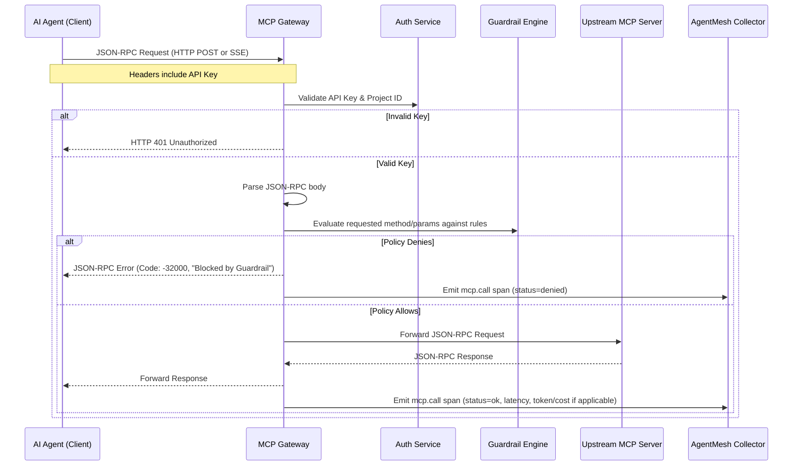

# MCP Security Gateway Architecture

## 1. Overview

The MCP Security Gateway (`mcp-gateway`) is a reverse proxy that sits between an AI Agent (the client) and an MCP Server. The Model Context Protocol (MCP) uses JSON-RPC 2.0 over two primary transports: stdio (for local servers) and HTTP/SSE (for remote servers).

The Gateway's purpose is to add the governance layer the MCP spec intentionally omits:
1. **Authentication:** Ensure the agent is authorized to call the specific MCP server.
2. **Guardrails (Firewall):** Intercept the JSON-RPC payload, parse the requested tool/resource, evaluate it against a declarative YAML policy, and explicitly block malicious or unauthorized requests.
3. **Audit Logging:** Emit an `mcp.call` span to the Collector for every request (allowed or denied), providing a complete security audit trail.

## 2. Sequence Diagram



## 3. Core Components

### 3.1 Proxy Transport Layer
Initially, we will target the HTTP/SSE transport, as it is the standard for remote, governed servers. The proxy will receive incoming HTTP requests, buffer the body to allow inspection, and use Go's `httputil.ReverseProxy` (customized with a `Director` and `ModifyResponse`) to forward traffic to the upstream MCP server.

### 3.2 JSON-RPC Interceptor
MCP uses JSON-RPC. A tool call request looks like this:
```json
{
  "jsonrpc": "2.0",
  "id": 1,
  "method": "tools/call",
  "params": {
    "name": "execute_query",
    "arguments": {
      "sql": "DROP TABLE users;"
    }
  }
}
```
The interceptor must parse this payload to extract the `method`, tool `name`, and `arguments`.

### 3.3 Guardrail Policy Engine
A declarative YAML engine. Example policy:
```yaml
policies:
  - name: prevent_destructive_sql
    target_tools: ["execute_query", "run_sql"]
    action: deny
    rules:
      - param_matches:
          param: "sql"
          pattern: "(?i)(DROP|DELETE|TRUNCATE|ALTER)"
```
The engine evaluates the extracted JSON-RPC parameters against these rules. If a match occurs, the proxy halts forwarding and synthesizes a JSON-RPC error response.

### 3.4 Audit Emitter
Integrates with the `shared/span` package and an OTLP exporter to send spans to the Collector asynchronously.

## 4. Implementation Steps

1. **Proxy Skeleton:** Build the basic HTTP reverse proxy that can forward traffic to a hardcoded upstream MCP server.
2. **Interception:** Add middleware to parse the JSON-RPC request body and read the method/params without breaking the proxy stream.
3. **Authentication:** Wire in `shared/authkeys.Authenticate` to secure the proxy endpoint.
4. **Policy Engine:** Implement the YAML parser and regex-based rule evaluator.
5. **Enforcement:** Connect the policy engine to the interceptor to actively block requests.
