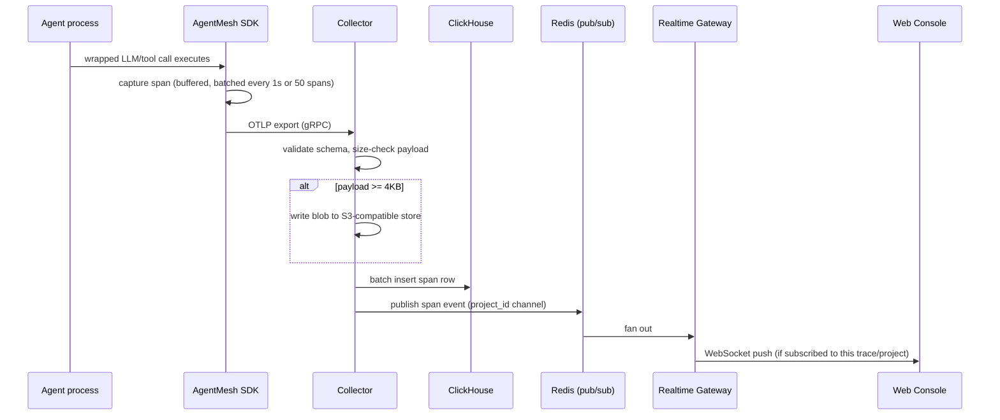
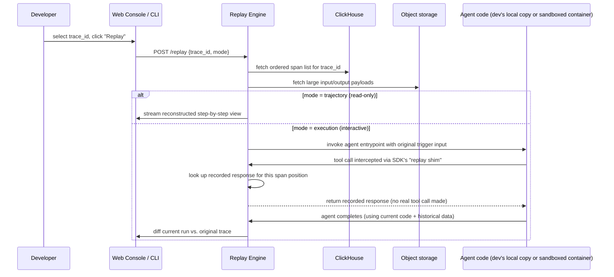
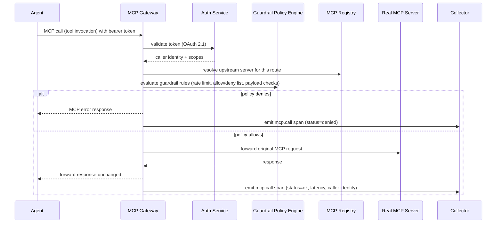

# AgentMesh — System Design

This document goes one level deeper than `Architecture.md`: concrete data models, request/data flows, and the scalability approach for the hardest subsystems.

## 1. Identifiers and Naming (disambiguation)

To avoid the single most common source of confusion in an observability product that also has its own internal operations:

- `trace_id` (customer-scoped) — identifies one agent run, generated by the SDK, follows the W3C Trace Context format so it interoperates with any other OTel tooling a customer already runs.
- `internal_trace_id` — AgentMesh's own operational tracing (Architecture.md §15), never exposed in the customer-facing API.
- `span_id` — unique within a `trace_id`, W3C-compatible.
- `project_id` — the tenant boundary; every span, API key, registry entry, and policy belongs to exactly one project.
- `replay_id` — identifies one execution of the Replay Engine against a source `trace_id`; a single trace can have many replay runs.

## 2. Data Model

### 2.1 ClickHouse — `spans` table (core trace store)

```
spans (
  project_id      UUID,
  trace_id        String,
  span_id         String,
  parent_span_id  Nullable(String),
  span_kind       Enum('llm.call','tool.call','agent.handoff','mcp.call'),
  name            String,          -- e.g. model name, tool name, agent name
  start_time      DateTime64(6),
  end_time        DateTime64(6),
  status          Enum('ok','error','timeout'),
  input_inline    Nullable(String),   -- inline if < 4KB
  output_inline   Nullable(String),
  input_blob_ref  Nullable(String),   -- object-store key if >= 4KB
  output_blob_ref Nullable(String),
  token_input     Nullable(UInt32),
  token_output    Nullable(UInt32),
  cost_usd        Nullable(Decimal(12,6)),
  attributes      Map(String, String) -- open-ended key/value, e.g. framework name, model version
)
ENGINE = MergeTree
PARTITION BY toYYYYMMDD(start_time)
ORDER BY (project_id, trace_id, start_time)
TTL start_time + INTERVAL 90 DAY DELETE  -- overridden per-project via a scheduled compaction job
```

A materialized view (`trace_rollups`) pre-aggregates per-trace duration, total tokens, and total cost so the trace-list view in the Web Console never has to scan raw spans.

### 2.2 Postgres — control-plane schema (abbreviated)

```
projects(id, name, retention_days, created_at)
api_keys(id, project_id, hashed_key, prefix, role, created_at, revoked_at)
mcp_servers(id, project_id, name, upstream_url, transport, version, owner, manifest_yaml)
guardrail_policies(id, project_id, mcp_server_id, rule_dsl, enabled, created_at)
alert_rules(id, project_id, kind /* cost_spike | loop_detected | guardrail_violation */, threshold, channel_config)
replay_runs(id, project_id, source_trace_id, status, started_at, completed_at, diff_summary)
sessions(id, project_id, external_user_ref, created_at)
trace_sessions(trace_id, session_id)   -- join table
```

### 2.3 Object storage layout

`s3://agentmesh-blobs/{project_id}/{trace_id}/{span_id}/{input|output}.bin`, with server-side encryption and a lifecycle policy mirroring `projects.retention_days`.

## 3. Ingestion Flow (SDK → ClickHouse)



Batching on both the SDK side (to avoid one network call per span) and the Collector side (ClickHouse strongly prefers batch inserts over row-by-row writes) is a deliberate, non-negotiable design constraint — see `Risks.md`, Performance Risks.

## 4. Replay Flow (the hardest subsystem)

**Determinism boundary.** Replay is possible for anything the SDK recorded as a span input/output. It is *not* possible for state the agent read without going through an instrumented call (e.g., a global variable mutated outside any wrapped function). The SDK documentation and the Replay Engine's UI must be explicit about this boundary — over-promising perfect replay for arbitrary code is a named risk (`Risks.md`, Product Risks).



The **replay shim** is a mode flag in the SDK itself: when a trace is replayed in "execution" mode, the SDK's tool-call wrapper checks an environment variable (`AGENTMESH_REPLAY_ID`); if set, it intercepts the call and returns the recorded response instead of executing the real tool, rather than the Replay Engine trying to monkey-patch the agent's tool dispatcher from the outside. This keeps the Replay Engine simple and pushes the interception boundary to the same place tracing already happens.

## 5. Scalability Approach

AgentMesh is designed to scale in three independent dimensions, deliberately not solved all at once:

1. **Ingestion throughput** — the Collector is stateless and horizontally scalable behind a load balancer; ClickHouse batch-insert buffering absorbs bursts. At MVP scale (single-node ClickHouse), this comfortably handles the traffic of a handful of design-partner customers. Sharding ClickHouse by `project_id` is the documented next step, deferred until real volume data justifies it (see `Risks.md`, Scalability Risks).
2. **Query latency** — the `trace_rollups` materialized view keeps the common "list recent traces with cost/duration" query fast without scanning raw spans; deep trace-DAG fetches are bounded by `trace_id`, which is always in the ClickHouse sort key.
3. **Realtime fan-out** — Redis pub/sub is sufficient until a project has hundreds of concurrent live-tailing dashboard sessions; if that becomes a bottleneck, the fix is sharding Redis channels by `project_id`, not a wholesale architecture change.

## 6. MCP Gateway Request Flow



The Gateway fails closed (Architecture.md §17): if `Auth` or `Reg` is unreachable, the request is denied, not silently forwarded.

## 7. Cost Attribution Model

`cost_usd` on each `llm.call` span is computed at ingestion time by the Collector using a small, versioned pricing table (model name → $/1K input tokens, $/1K output tokens) refreshed periodically from a config file (not a live external pricing API at MVP, to avoid an ingestion-path dependency on a third-party service — see Architecture.md §17's error-handling philosophy). `tool.call` spans carry a `cost_usd` only if the SDK wrapper is explicitly configured with a per-call cost (e.g., a paid search API); otherwise it defaults to null and is excluded from cost rollups rather than assumed to be zero (an explicit design choice to avoid understating cost).

## 8. Anomaly Detection Design (Milestone 7)

A streaming consumer of the same Redis span-event stream used by the Realtime Gateway, running three initial detectors:

- **Loop detector:** flags a trace where the same `(span_kind, name)` pair repeats more than N times (configurable per project) within a single trace without a change in output — a strong signal of an agent stuck retrying the same failing action.
- **Cost-spike detector:** flags a trace whose running `cost_usd` total exceeds a per-project threshold before the trace completes, enabling near-real-time alerting rather than only after-the-fact dashboard review.
- **Guardrail-violation detector:** flags any `mcp.call` span with `status=denied`, aggregated per caller to catch a misbehaving agent hammering a blocked tool.

Each detector emits an `alert_event` row consumed by the Alerting Service; the detection logic is intentionally rule-based (not ML-based) for MVP — the "AI-suggested chaos scenarios"-style anomaly detection from the original portfolio concept is explicitly deferred to a post-MVP innovative feature (`Feature Roadmap.md`) once there's a real trace corpus to train against.
